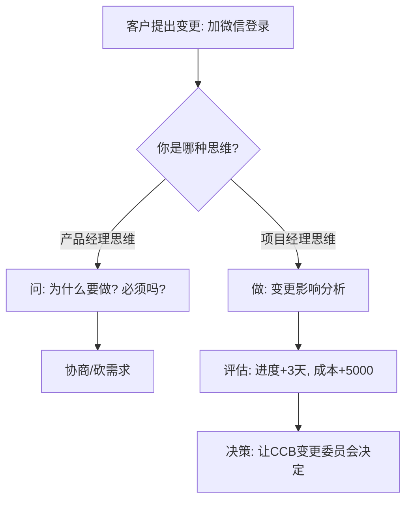
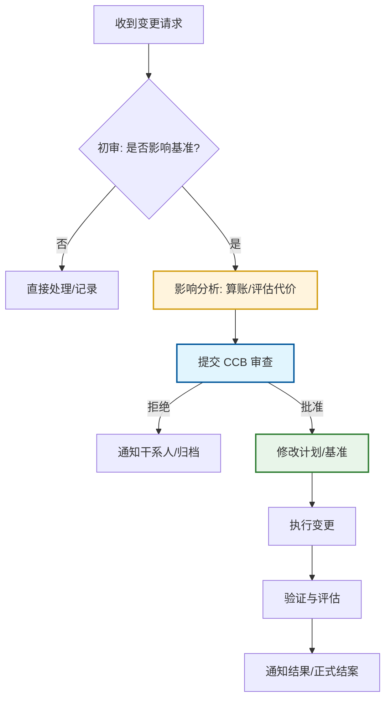

## 1. 会话概览 (Session Overview)

- 日期: 2025-12-21
- 时长: 进行中
- 主要主题:
  - [B.2] 范围管理 (Scope Creep)
  - [C.1] 进度管理 (Schedule & Estimation)

---

## 2. 核心交互记录 (Interaction Log)

### 主题 1: 痛点诊断 - 范围与进度的双重困境

#### 你的问题/场景 (Your Question/Scenario)
用户选择了 "1. 永远在变的甲方" 和 "2. 不知所措的排期" 作为核心痛点。
这反映了实际项目中"范围蔓延导致进度失控"的典型连锁反应。

#### 你的初始理解 (Your Initial Understanding)
- [✓] 正确认为: 需求变更是导致项目混乱的主要原因。
- [✓] 正确认为: 进度估算不准是结果，而非单一原因。
- [ ] 还没想清楚: 如何系统性地通过"控制范围"来"挽救进度"。

#### 提供的解释 (Explanation Given)
用户表现出了优秀的产品思维（挖掘需求背后的动机），但这与项目管理的"范围控制"思维有微妙区别。
核心解释：
1. **产品思维 vs 项目思维**：产品经理问"为什么要做"（价值导向），项目经理要问"做了有什么后果"（交付导向）。
2. **变更影响分析 (Impact Analysis)**：这是软考标准答案。在答应或拒绝前，必须先评估这个变更对"进度、成本、质量"的具体影响。
3. **范围基准 (Scope Baseline)**：所有变更必须基于一个已确认的基准，否则就是"随意蔓延"。

#### 理解检查 (Comprehension Checks)

- **问题(Q):** 面对变更请求，PM 的第一反应动作是什么？
- **我的回答(A):** "挖掘需求动机"（用户回答） vs "变更影响分析"（考试答案）。
- **标记:** △ 部分正确（有很好的业务意识，但缺乏管理程序的严谨性）
- **洞察:** 用户倾向于从业务协商解决问题，而考试侧重于"程序合规"和"全盘影响评估"。
- **理解程度:** 良好

#### 📊 本主题的流程图（若有）



---

### 主题 2: 变更控制流程 (Change Control Process)

#### 你的问题/场景 (Your Question/Scenario)
如何将这种"直觉"转化为考试能得分的"标准流程"？

#### 你的初始理解 (Your Initial Understanding)
- [ ] 还没想清楚: 具体的变更流程七步法是什么。

#### 提供的解释 (Explanation Given)
核心流程（变更控制七步法）：
1. 提出变更申请（书面）
2. 初步审查（过滤明显不靠谱的）
3. **变更影响分析**（核心步骤：算进度、成本、质量的账）
4. CCB 审查批准（决策）
5. 实施变更（干活）
6. 监控变更实施（盯着）
7. 变更验证与归档（确认）

关键术语：**CCB (Change Control Board)** - 变更控制委员会。考试中，所有重要变更必须由 CCB 拍板，PM 只有分析权和执行权，没有最终决策权。

#### 理解检查 (Comprehension Checks)

- **问题(Q):** 项目中期客户要求加功能，资源有限且必然延期，PM 应如何应对？
- **我的回答(A):** C. 建议"加一减一"（置换）。
- **标记:** ✓ 正确
- **洞察:** 用户正确识别了"资源平衡"和"范围置换"的策略。这在 PMBOK 中隐含在"赶工(Crashing)"和"快速跟进(Fast Tracking)"均失效时的谈判策略。
- **理解程度:** 优秀
  
#### 📊 变更控制流程图 (Change Control Flow)



---

### 主题 3: 进度压缩 (Crashing vs. Fast Tracking)

#### 你的问题/场景 (Your Question/Scenario)
如果为了保证质量，不能压需求分析的时间，但总工期又必须缩短，你会怎么办？

#### 你的初始理解 (Your Initial Understanding)
- [✓] 正确认为: 需求分析时间不能乱压，否则后期成本更高。
- [✓] 正确识别: 增加服务器（资源）是解决办法之一，但要看是否正相关。

#### 提供的解释 (Explanation Given)
1.  **赶工 (Crashing)**: 增加资源（加人、加服务器、加班）。
    - *代价*: 成本增加。
2.  **快速跟进 (Fast Tracking)**: 并行作业（需求还没完，开发就开始）。
    - *代价*: 风险增加（可能返工）。

#### 📊 进度压缩对比图

```mermaid
graph LR
    subgraph Crashing [赶工 Crashing (加资源)]
    A1[任务A] --- B1[任务B]
    style A1 fill:#ffcdd2
    style B1 fill:#ffcdd2
    end

    subgraph FastTracking [快速跟进 Fast Tracking (并行)]
    A2[任务A]
    B2[任务B]
    A2 -.-> B2
    style B2 fill:#fff9c4
    end
```

---

### 主题 4: 活动逻辑关系 (Logic Relations)

#### 你的问题/场景 (Your Question/Scenario)
你说"开发和设计是可以并行的，后端动工等设计完，前端再修补"。这属于哪种逻辑？

#### 你的初始理解 (Your Initial Understanding)
- [✓] 正确识别: 这种情况属于 **SS (Start-to-Start)**。
- [✓] 正确洞察: 并非所有事情都要等前一件做完。

#### 📊 活动逻辑关系图

```mermaid
graph TD
    subgraph FS [FS (结束-开始)]
    A1[打地基] --> B1[盖楼]
    end
    
    subgraph SS [SS (开始-开始) - 你的场景]
    A2[后端开发] 
    B2[UI设计]
    A2 -- "并行" --- B2
    style A2 fill:#e1f5fe
    style B2 fill:#e1f5fe
    end
```

---

### 主题 5: 关键路径法 (CPM) 与 浮动时间 (Float)

#### 你的问题/场景 (Your Question/Scenario)
我们通过一个简单的 4 任务模型来攻克进度管理中最核心的计算题。

#### 你的初始理解 (Your Initial Understanding)
- [✓] 正确认为: 关键路径是耗时最长的那条路。
- [✓] 正确计算: 3(A) + 5(C) + 4(D) = 12 天。
- [✓] 深刻洞察: 即使设计和开发并行，项目总工期取决于最慢的那个环节（开发）。

#### 提供的解释 (Explanation Given)
1. **关键路径 (Critical Path)**: 网络图中**最长**的那条路径。它决定了项目**最短**能几天干完。
2. **总浮动时间 (Total Float)**: 
   - 既然 A -> C -> D 是 12 天（最长），那 A -> B -> D 只有 3+2+4=9 天。
   - 这意味着任务 B (设计) 有 3 天的"摸鱼时间"（12 - 9 = 3）。
   - 这 3 天就叫**总浮动时间**。
   - **关键路径上的任务，浮动时间为 0。** (因为它们一刻都不能耽误)

#### 理解检查 (Comprehension Checks)

- **问题(Q):** 路径1 (A:3天 -> B:4天) 与 路径2 (C:5天 -> D:4天) 并行，E 必须等全部完成。A 有几天浮动时间？
- **我的回答(A):** 用户准确计算出关键路径为 9 天 (C+D)，路径 1 总长 7 天，因此有 2 天摸鱼时间。
- **标记:** ✓ 正确
- **洞察:** 用户完全理解了"总浮动时间 (Total Float)"的本质：它是非关键路径相对于关键路径的"时间差"。
- **理解程度:** 优秀

#### 📊 本主题的流程图（若有）

```mermaid
graph LR
    subgraph CriticalPath [关键路径 (Critical Path)]
    C[C: 外包任务1 (5天)] --> D[D: 外包任务2 (4天)]
    end
    
    subgraph NonCriticalPath [非关键路径 (Float: 2天)]
    A[A: 团队任务1 (3天)] --> B[B: 团队任务2 (4天)]
    end
    
    D --> E[E: 最终验收]
    B --> E
    
    style C stroke:#f00,stroke-width:4px
    style D stroke:#f00,stroke-width:4px
```

---

## 3. 识别出的知识盲区与下次行动项

### 知识盲区表

| 主题 | 严重程度 | 备注 | 解决状态 |
|------|--------|------|--------|
| [B.2] 变更控制流程七步法 | 中 | 虽然直觉很好，但需要背诵标准流程（CCB, 影响分析） | 部分 |
| [C.3] 关键路径计算 (CPM) | 高 | 基础概念已懂，需进阶掌握"六标时法" | 进行中 |

### 🎯 针对上述盲区的下次行动项

- [ ] **[解决变更流程盲区]**:
  - 复习一次变更控制七步法

- [ ] **[解决关键路径盲区]**:
  - 下次会话重点攻克"六标时法"（最早开始/最晚开始时间计算）

### 📋 行动项-盲区映射

| 行动项 | 对应盲区 | 优先级 |
|--------|--------|--------|
| 记忆变更七步法 | B.2 变更控制 | 高 |
| 学习六标时法 | C.3 关键路径 | 最高 |

---

## 4. 本次掌握的主题总结 (Topics Mastered Today)

| 主题 | 信心指数 | 备注 | 来源 |
|------|--------|------|------|
| [C.3] 关键路径计算 (CPM) | 优秀 | 准确计算出关键路径时长，理解"长板效应" | 主题 5 理解检查 |
| [C.1] 活动逻辑关系 (SS/FS) | 优秀 | 凭直觉准确识别出 Start-to-Start 关系 | 主题 4 理解检查 |
| [C.2] 进度压缩策略 (Crashing) | 优秀 | 准确识别了快速跟进的风险，选择了正确的赶工策略 | 主题 3 理解检查 |
| [B.4] 变更影响分析 (Impact Analysis) | 良好 | 从产品思维成功切换到项目管理的"算账"思维 | 主题 2 理解检查 |
| [B.2] 范围蔓延 (Scope Creep) | 良好 | 深刻理解痛点，识别了产品思维与项目思维的差异 | 主题 1 理解检查 |

#### 理解检查 (Comprehension Checks)
待定。
