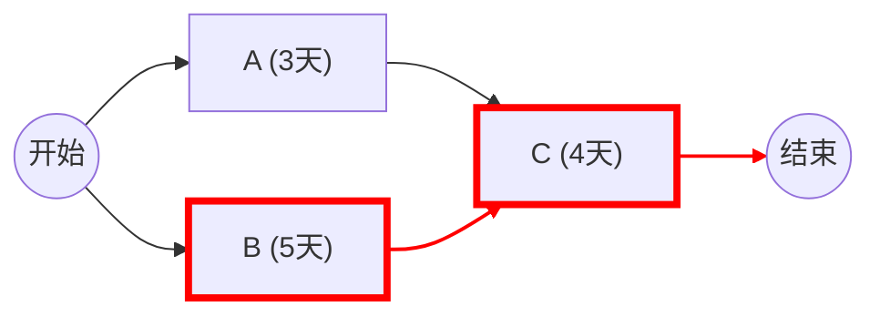

# 学习会话记录 - 2026-01-07

## 1. 会话概览 (Session Overview)

- 日期: 2026-01-07
- 时长: 进行中
- 主要主题:
  - 初始诊断 (Diagnostic)
  - Domain 2: 进度管理 (Schedule Management) - 关键路径与估算

---

## 2. 核心交互记录 (Interaction Log)

### 主题 0: 初始痛点诊断

#### 你的问题/场景
"感觉每一个（管理问题）都让我头大。"

#### 你的初始理解
[ ] 感到全面失控，缺乏抓手。

#### 提供的解释
这是典型的"基准缺失"症状。当进度、范围、成本都没有坚实的基准时，项目管理就会变成"救火"。
策略：从权重最高、痛感最强的 **Domain 2 进度管理** 切入。治好了"拖延症"，通常能缓解 50% 的焦虑。

---

### 主题 1: 进度估算与关键路径 (Schedule Estimation & CPM)

#### 你的问题/场景
"说实话是 B（问开发+加缓冲），但我知道你的准确答案是 C。"

#### 你的初始理解
用【✓/✗/空】清单列出：
- [ ] 凭经验/直觉 ("大概3天")
- [✓] 问开发人员然后加缓冲 (实战常用，专家判断 + 储备分析的雏形)
- [ ] 拆解活动 -> 估算 -> 关键路径分析 (理论正确，但执行成本高)

#### 提供的解释
选 B 不丢人，这其实对应了标准里的 **专家判断 (Expert Judgment)** 和 **储备分析 (Reserve Analysis)**。
但在软考和复杂项目中，B 的致命伤是：**看不见依赖关系**。
如果任务之间是串行的（做完 A 才能做 B），你加的缓冲可能够用；但如果是并行的、错综复杂的，你凭感觉加的缓冲，往往加在了非关键路径上，结果该延期还是延期。

**核心概念引入：关键路径法 (CPM)**
只有通过 **活动排序** 画出网络图，找到最长的那条路径（关键路径），你才能自信地告诉领导：“少于 15 天绝对做不完，除非给我加人。”

#### 理解检查 (Comprehension Checks - 3 Layer Verify)

- **L1 理论层(Q):** 假设你有 3 个任务：A(3天), B(5天), C(4天)。A 和 B 可以同时开始，C 必须等 A 和 B 都做完才能开始。请问整个项目的**最短工期**是多少天？**关键路径**是哪一条？
- **L1 回答(A):** 9 天；B-C 是关键路径；A 延期 1 天不影响项目总工期。(Pass)

- **L2 应用层(Q):** 
  现在领导给你下了死命令：**"这个项目必须 8 天做完！"**
  你需要进行**进度压缩 (Schedule Compression)**。
  已知：
  - 压缩 A 需要 1000 元/天
  - 压缩 B 需要 2000 元/天
  - 压缩 C 需要 3000 元/天
  
  你会选择压缩哪个任务？为什么？

- **L2 回答(A):** 选 B。(Pass)
  - **解析**:
    - **A**: 它是非关键路径，压它 1 天变成 2 天，关键路径 B+C 还是 9 天。浪费钱。
    - **C**: 是关键路径，压它确实能变成 8 天，但要花 3000 元。
    - **B**: 是关键路径，压它也能变成 8 天，只要 2000 元。
    - **结论**: 找关键路径上 **性价比最高 (Cost-Benefit Ratio)** 的活动。

- **L3 批判层(Q):** 
  你选择了压缩 B，花 2000 元把项目变成了 8 天。
  **但是**，如果在压缩 B 的过程中，因为赶工导致代码质量下降，产生了一个严重的 Bug，修复它花了 3 天。
  这在 PMBOK 第 4 版里叫什么风险？这告诉我们在做“赶工”时必须同时注意什么？

- **L3 回答(A):** 质量 (Quality)。(Pass)
  - **核心考点**: 赶工 (Crashing) 会增加风险和降低质量。
  - **铁三角原理**: 进度、成本、质量是联动的。你强行压进度（时间），要么加钱（成本），要么牺牲做工（质量）。
  - **实战教训**: 越是赶工期，越要加强 QA/QC（质量保证/控制），否则返工会抵消所有的赶工成果。

- **最终判定:** 掌握 (Mastered)

#### 📊 本主题的流程图

## 3. 识别出的知识盲区与下次行动项

### 知识盲区表

| 主题 | 严重程度 | 备注 | 解决状态 |
|------|--------|------|--------|
| **关键路径法 (CPM)** | 中 | 虽然理解了逻辑，但需要通过复杂网络图计算来强化 | 部分解决 |
| **进度压缩副作用** | 高 | 实战中容易忽略“赶工导致质量下降”的风险 | 已解决 |

### 🎯 针对上述盲区的下次行动项

- [ ] **强化 CPM 计算**: 下次会话练习一道真实的软考计算真题（包含 10 个以上节点）。
- [ ] **建立基准意识**: 在下次项目中尝试画出简单的网络图，而不是只列 To-do list。

---

## 4. 本次掌握的主题总结 (Topics Mastered Today)

| 主题 | 信心指数 | 备注 | 来源 |
|------|--------|------|------|
| **进度估算与关键路径** | 🟢 掌握 | 理解了 CPM 逻辑、赶工性价比选择、质量风险联动 | 主题 1 理解检查 |
