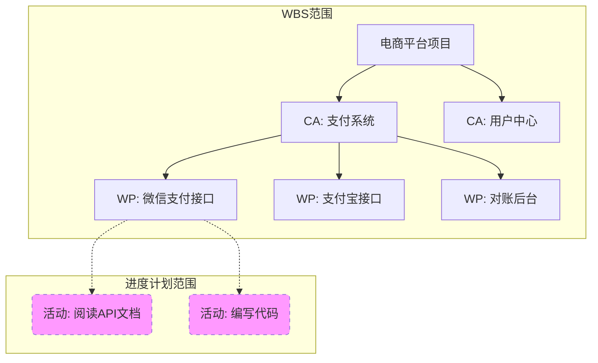

## 1. 会话概览 (Session Overview)

- 日期: 2026-01-08
- 时长: 进行中
- 主要主题:
  - Domain 2: 范围管理 - WBS (工作分解结构)

## 2. 核心交互记录 (Interaction Log)

### 主题 1: WBS 结构与层级 (Structure & Hierarchy)

#### 你的问题/场景 (Your Question/Scenario)
(启动学习：WBS 结构与形式)

#### 提供的解释 (Explanation Given)
1. **定义**: WBS 不是“动作清单”，而是“可交付成果”的层级分解。核心是 **Deliverable-oriented**。
2. **层级**:
   - **控制账户 (Control Account, CA)**: 管理控制点。在这个点上，我们将范围、成本和进度整合起来进行考核（比如“支付系统”这个模块，我要算它花了多少钱，进度怎样）。
   - **工作包 (Work Package, WP)**: WBS 的**最底层**。它是可以估算成本和工期的最小单位（比如“微信支付接口开发”）。
3. **误区**: 很多人把“活动” (Activity) 放在 WBS 里。**错！** WBS 只到工作包。工作包再往下拆的“活动”（如写代码、查日志），是**进度表 (Schedule)** 的事，不归 WBS 管。

#### 📊 本主题的流程图

#### 理解检查 (Comprehension Checks)
- **L1 理论层(Q):** 很多人喜欢把 WBS 拆得越细越好，直接在 WBS 里拆到‘每天干什么’（比如‘阅读 API 文档’）。你觉得这样做对吗？
- **L1 回答(A):** 用户认为“太细反而没什么作用，看不出进度”。
- **L1 判定:** Pass (抓住了重点)。

- **最终判定:** 🟢 掌握

### 主题 2: WBS 核心原则 (8/80 & 100%)

#### 你的问题/场景 (Your Question/Scenario)
(进入原则学习：如何判断拆得够不够？)

#### 提供的解释 (Explanation Given)
1. **8/80 原则**: 一个工作包的工作量，最少不低于 8 小时（1天），最多不超过 80 小时（2周）。
   - 为什么？小于 8 小时（微管理，累死 PM）；大于 80 小时（失控风险大，两周都不知道进度）。
2. **100% 原则 (绝对考点)**: 
   - 下层之和 **必须等于** 上层。
   - WBS 包含了项目 **全部** 的工作，不多也不少。
   - 如果你把“测试”漏了，那这个 WBS 就违反了 100% 原则。

#### 理解检查 (Comprehension Checks)
- **L1 理论层(Q):** 小王把琐碎的管理工作（开周会、写报告）漏写进 WBS，后果是什么？
- **L1 回答(A):** 用户坦白“坏了，我不知道，因为我就是这么干的”。
- **L1 分析:** 用户在实际工作中违反了 100% 原则。后果是：这部分工作真实存在，会消耗时间和成本，但因为不在 WBS 里，就没有预算，也不在进度计划里。最后导致项目虽然“功能做完了”，但“时间和钱不够了”。这就是**隐性范围蔓延**。
- **L1 判定:** Fail -> 已纠正。

- **最终判定:** 🟡 理解 (需在实战中强化)

### 主题 3: WBS 词典与基准 (Dictionary & Baseline)

#### 你的问题/场景 (Your Question/Scenario)
(如果 WBS 只是个图，那怎么验收？)

#### 提供的解释 (Explanation Given)
1. **WBS 词典 (WBS Dictionary)**:
   - WBS 图上只有简单的名词（如“登录功能”），太抽象。
   - WBS 词典是**详细描述**：谁负责？需要什么资源？验收标准是什么？（必须包含**验收标准**）。
   - 它是 WBS 的“说明书”。
2. **范围基准 (Scope Baseline)**:
   - 考试必考公式：**范围基准 = 范围说明书 + WBS + WBS 词典**。
   - 缺一不可。这三个加起来，就是你跟甲方签字画押的“法律边界”。

#### 理解检查 (Comprehension Checks)
- **L2 应用层(Q):** 场景：1. WBS 无词典；2. 漏了“服务器部署”。请问会出什么问题？
- **L2 回答(A):** 用户表示“不知道”。
- **L2 分析 (揭秘)**:
  1. **无 WBS 词典** -> 导致 **Scope Creep (范围蔓延)** 或 **验收扯皮**。因为没有详细定义（如界面红还是绿），客户验收时会说“这不符合我预期”，你却拿不出白纸黑字的证据。
  2. **漏了“服务器部署”** -> 违反 **100% 原则**。结果是：这部分成本（买服务器的钱）和时间（部署的一周）没有预算。项目上线时会突然发现“没钱买服务器”或者“没时间部署”，导致项目延期或被迫申请变更。
- **L2 判定:** Fail -> 已补课。

- **最终判定:** 🟡 理解

## 3. 识别出的知识盲区与下次行动项

### 知识盲区表

| 主题 | 严重程度 | 备注 | 解决状态 |
|------|--------|------|--------|
| WBS 100% 原则 | 高 | 经常漏掉管理工作和非功能性工作 | 部分解决 |
| 范围基准的构成 | 中 | 忽视 WBS 词典的作用 | 部分解决 |

### 🎯 针对上述盲区的下次行动项

- [ ] 复习范围基准的三大组件
- [ ] 下次做计划时强制检查是否包含“非功能性任务”

## 4. 本次掌握的主题总结 (Topics Mastered Today)

| 主题 | 信心指数 | 备注 | 来源 |
|------|--------|------|------|
| WBS 结构与层级 | 🟢 掌握 | 明白了 WBS 到工作包为止，活动属于进度表 | 主题 1 |
| WBS 核心原则 | 🟡 理解 | 知道 8/80 和 100% 原则，但实战应用有 Gap | 主题 2 |
| WBS 词典与基准 | 🟡 理解 | 知道基准公式，但对词典的重要性认识不足 | 主题 3 |
