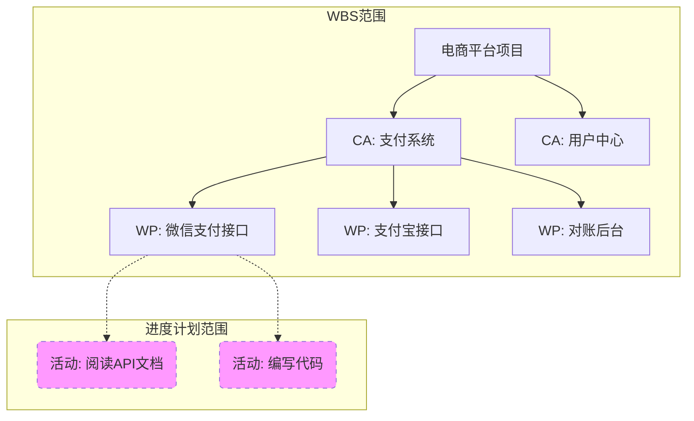
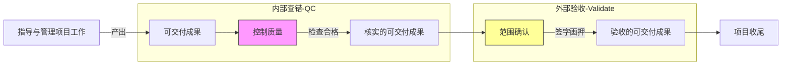
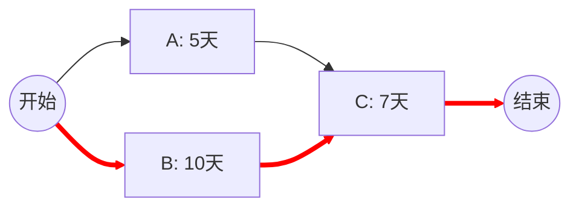
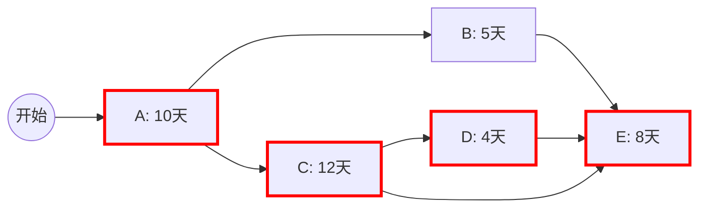

## 1. 会话概览 (Session Overview)

- 日期: 2026-01-08
- 时长: 进行中
- 主要主题:
  - Domain 2: 范围管理 - WBS (工作分解结构)
  - Domain 2: 进度管理 - 关键路径法 (CPM)

## 2. 核心交互记录 (Interaction Log)

### 主题 1: WBS 结构与层级 (Structure & Hierarchy)

#### 你的问题/场景 (Your Question/Scenario)
(启动学习：WBS 结构与形式)

#### 提供的解释 (Explanation Given)
1. **定义**: WBS 不是“动作清单”，而是“可交付成果”的层级分解。核心是 **Deliverable-oriented**。
2. **层级**:
   - **控制账户 (Control Account, CA)**: 管理控制点。在这个点上，我们将范围、成本和进度整合起来进行考核（比如“支付系统”这个模块，我要算它花了多少钱，进度怎样）。
   - **工作包 (Work Package, WP)**: WBS 的**最底层**。它是可以估算成本和工期的最小单位（比如“微信支付接口开发”）。
3. **误区**: 很多人把“活动” (Activity) 放在 WBS 里。**错！** WBS 只到工作包。工作包再往下拆的“活动”（如写代码、查日志），是**进度表 (Schedule)** 的事，不归 WBS 管。

#### 📊 本主题的流程图

#### 理解检查 (Comprehension Checks)
- **L1 理论层(Q):** 很多人喜欢把 WBS 拆得越细越好，直接在 WBS 里拆到‘每天干什么’（比如‘阅读 API 文档’）。你觉得这样做对吗？
- **L1 回答(A):** 用户认为“太细反而没什么作用，看不出进度”。
- **L1 判定:** Pass (抓住了重点)。

- **最终判定:** 🟢 掌握

### 主题 2: WBS 核心原则 (8/80 & 100%)

#### 你的问题/场景 (Your Question/Scenario)
(进入原则学习：如何判断拆得够不够？)

#### 提供的解释 (Explanation Given)
1. **8/80 原则**: 一个工作包的工作量，最少不低于 8 小时（1天），最多不超过 80 小时（2周）。
   - 为什么？小于 8 小时（微管理，累死 PM）；大于 80 小时（失控风险大，两周都不知道进度）。
2. **100% 原则 (绝对考点)**: 
   - 下层之和 **必须等于** 上层。
   - WBS 包含了项目 **全部** 的工作，不多也不少。
   - 如果你把“测试”漏了，那这个 WBS 就违反了 100% 原则。

#### 理解检查 (Comprehension Checks)
- **L1 理论层(Q):** 小王把琐碎的管理工作（开周会、写报告）漏写进 WBS，后果是什么？
- **L1 回答(A):** 用户坦白“坏了，我不知道，因为我就是这么干的”。
- **L1 分析:** 用户在实际工作中违反了 100% 原则。后果是：这部分工作真实存在，会消耗时间和成本，但因为不在 WBS 里，就没有预算，也不在进度计划里。最后导致项目虽然“功能做完了”，但“时间和钱不够了”。这就是**隐性范围蔓延**。
- **L1 判定:** Fail -> 已纠正。

- **最终判定:** 🟡 理解 (需在实战中强化)

### 主题 3: WBS 词典与基准 (Dictionary & Baseline)

#### 你的问题/场景 (Your Question/Scenario)
(如果 WBS 只是个图，那怎么验收？)

#### 提供的解释 (Explanation Given)
1. **WBS 词典 (WBS Dictionary)**:
   - WBS 图上只有简单的名词（如“登录功能”），太抽象。
   - WBS 词典是**详细描述**：谁负责？需要什么资源？验收标准是什么？（必须包含**验收标准**）。
   - 它是 WBS 的“说明书”。
2. **范围基准 (Scope Baseline)**:
   - 考试必考公式：**范围基准 = 范围说明书 + WBS + WBS 词典**。
   - 缺一不可。这三个加起来，就是你跟甲方签字画押的“法律边界”。

#### 理解检查 (Comprehension Checks)
- **L2 应用层(Q):** 场景：1. WBS 无词典；2. 漏了“服务器部署”。请问会出什么问题？
- **L2 回答(A):** 用户表示“不知道”。
- **L2 分析 (揭秘)**:
  1. **无 WBS 词典** -> 导致 **Scope Creep (范围蔓延)** 或 **验收扯皮**。因为没有详细定义（如界面红还是绿），客户验收时会说“这不符合我预期”，你却拿不出白纸黑字的证据。
  2. **漏了“服务器部署”** -> 违反 **100% 原则**。结果是：这部分成本（买服务器的钱）和时间（部署的一周）没有预算。项目上线时会突然发现“没钱买服务器”或者“没时间部署”，导致项目延期或被迫申请变更。
- **L2 判定:** Fail -> 已补课。

- **最终判定:** 🟡 理解

### 主题 4: WBS 100% 原则实战演练 (The 100% Rule Drill)

#### 你的问题/场景 (Your Question/Scenario)
**实战场景**: 一个 OA 升级项目的 WBS 只有功能模块（请假、报销、移动端、迁移）。
**问题**: 这有没有违反 100% 原则？如果违反了，漏了什么？

#### 你的初始理解 (Your Initial Understanding)
- [✗] 错误认为: "我觉得没问题" (Fail)

#### 提供的解释 (Explanation Given)
**直接反驳**: 问题很大！违反了 100% 原则。
1. **项目管理工作** (Project Management): 你作为 PM，开会、写文档、沟通、汇报不需要时间吗？这些工作通常占总工时的 10-15%。如果不写进 WBS，你的工资谁发？时间从哪儿扣？
2. **非功能性工作** (Non-functional): 测试、部署、培训、验收。代码写完了不等于项目结束了。
3. **后果**: 因为 WBS 里没这些，所以**进度计划**里也没这些。最后结果就是：开发做完了，为了赶上线，你和团队疯狂加班做测试和部署，而且还没有加班费（因为预算没包）。

#### 理解检查 (Comprehension Checks)
- **L2 实战层(Q):** (当前步骤) 要求用户列出被遗漏的 3 个关键工作包。
- **L2 回答(A):** 用户准确识别出缺少：1. 项目管理工作；2. 验证和交付；3. 质量把控。
- **L2 分析:** 🎯 命中靶心。用户修正了之前的认知偏差，意识到 WBS 必须包含“管理”和“质量”等支持性工作。
- **最终判定:** 🟢 掌握

### 主题 5: 范围确认 vs 质量控制 (Validate Scope vs Control Quality)

#### 你的问题/场景 (Your Question/Scenario)
(从 WBS 遗漏的“质量”和“交付”引出：这两个有什么区别？)

#### 你的初始理解 (Your Initial Understanding)
- [✓] 正确认为: 1是质量控制，2是范围确认。
- [✓] 正确认为: 顺序是先 1 (QC) 后 2 (Validate)。

#### 提供的解释 (Explanation Given)
**完全正确！** 你的直觉很准。

1.  **质量控制 (Control Quality)**:
    - **谁做**: 内部团队 (测试/PM)。
    - **目的**: 确保**正确性** (Correctness)。查 Bug，看是否符合技术标准。
    - **产出**: **核实的可交付成果 (Verified Deliverables)**。
2.  **范围确认 (Validate Scope)**:
    - **谁做**: **客户**或发起人。
    - **目的**: 确保**验收** (Acceptance)。看是否满足业务需求，签字画押。
    - **产出**: **验收的可交付成果 (Accepted Deliverables)**。

**铁律顺序**: **先 QC，后 Validate**。
*理由*: 你绝不能拿着满是 Bug 的东西去找客户验收，那是找骂。必须自己先确认为“核实的可交付成果”，才有资格提交给客户做“验收”。

#### 📊 流程图：从干活到验收

#### 理解检查 (Comprehension Checks)
- **L1 理论层(Q):** (当前) 区分清楚了 QC 和 Validate 的输入输出关系。
- **最终判定:** 🟢 掌握

### 主题 6: 范围蔓延与变更控制 (Scope Creep & Change Control)

#### 你的问题/场景 (Your Question/Scenario)
**场景**: 客户老板在走廊里口头要求加“人脸识别”功能。
**选项**: A. 敏捷响应 (直接做); B. 委婉拒绝; C. 正式流程 (走CCB); D. 口头答应。

#### 你的初始理解 (Your Initial Understanding)
- [✓] 正确选择: C (正式流程)。

#### 提供的解释 (Explanation Given)
**绝对正确！** 选 C 是唯一的活路。

1.  **范围蔓延 (Scope Creep)**: 任何**未经控制**的变更（选 A 或 D）都叫范围蔓延。它的特征是：没有对应的时间、成本调整。
    - *结果*: 你做了好事（加了功能），但项目延期了、预算超了，最后绩效还是差。
2.  **变更控制 (Change Control)**: 我们**不拒绝变更**，我们拒绝**白嫖**。
    - **金句**: "老板，这个功能很棒（肯定价值）。我回去评估一下它对上线时间的影响，如果需要延期或加钱，我打个报告给您签字（走流程）。"
    - 这就是 C 选项的本质：**把“隐性风险”转化为“显性决策”**。让老板自己决定：是要“人脸识别”还是要“按时上线”？

#### 理解检查 (Comprehension Checks)
- **L2 实战层(Q):** 面对变更，PM 的第一反应是什么？
- **L2 回答(A):** 不是 Say No，也不是 Say Yes，而是 **"Let me assess the impact" (让我评估影响)**。
- **最终判定:** 🟢 掌握

### 主题 7: 进度管理原子知识点 (Schedule Management Topology)

#### 知识拓扑 (Knowledge Topology)
为了彻底掌握 **B.1 进度管理**，我们需要攻克以下 4 个原子点：

1.  **前导图 (PDM) 与活动排序**: 知道谁先做、谁后做 (FS, SS, FF, SF)。
2.  **关键路径法 (CPM)**: **核心中的核心**。找出项目最短工期，计算 ES/EF, LS/LF。
3.  **浮动时间 (Float)**: 谁可以偷懒？(总浮动时间 vs 自由浮动时间)。
4.  **进度压缩**: 赶不上了怎么办？(赶工 vs 快速跟进)。

#### 你的问题/场景 (Your Question/Scenario)
(启动诊断：直觉测试)
**场景**: 你有三个任务。
- 任务 A: 5 天
- 任务 B: 10 天
- 任务 C: 7 天
A 和 B 是并行的（可以同时做），C 必须等 A 和 B **都做完**才能开始。

**问题 1**: 这个项目总工期是多少天？
**问题 2**: 如果 A 拖延了 3 天（变成 8 天），项目总工期会受影响吗？

#### 提供的解释 (Explanation Given)
**完全正确！** 你的直觉已经掌握了关键路径法的核心逻辑。

1.  **关键路径 (Critical Path)**:
    - 路径 1: A (5) -> C (7) = 12 天
    - 路径 2: B (10) -> C (7) = 17 天
    - **定义**: 项目中**最长**的那条路径，决定了项目的**最短**工期。
    - 在这个例子里，`Start -> B -> C -> End` 就是关键路径。所以总工期是 17 天。
2.  **浮动时间 (Float)**:
    - 因为 A 只需要 5 天，而跟它并行的 B 需要 10 天，所以 A 有 `10 - 5 = 5` 天的“摸鱼时间”。
    - 只要 A 不拖延超过 5 天，就不会影响 C 的开始，也就不会影响总工期。这 5 天就叫 **总浮动时间 (Total Float)**。

#### 📊 关键路径示意图

*注：红色路径 (B->C) 为关键路径，决定了总工期 17 天。*

#### 理解检查 (Comprehension Checks)
- **L1 诊断层(Q):** 见上。
- **L1 回答(A):** 用户正确回答 17 天，且识别出 A 不影响工期。
- **最终判定:** 🟢 掌握

### 主题 8: 找关键路径 (Find the Critical Path)

#### 你的问题/场景 (Your Question/Scenario)
(进阶测试：稍微复杂一点的网络图)
**场景**:
- 路径 1: A->B->E = 10 + 5 + 8 = 23
- 路径 2: A->C->D->E = 10 + 12 + 4 + 8 = 34
- 路径 3: A->C->E = 10 + 12 + 8 = 30

**问题**:
1. 关键路径是哪条？
2. 如果活动 D 延期 2 天，项目总工期变多少？
3. 如果活动 B 提前 1 天完成，项目总工期变多少？

#### 提供的解释 (Explanation Given)
用户反馈：“目前看着 C 是关键路径；看不出来，信息不够全。”→ 补充完整的**网络关系**与**时标计算**如下：

1. **明确依赖关系 (PDM)**：
   - A 之后分两路：到 B、到 C
   - C 之后到 D
   - E 的前置为 B、D、C（同时为前置）
2. **活动持续时间**：A=10，B=5，C=12，D=4，E=8（单位：天）
3. **前推 (ES/EF)**：
   - ES(A)=0 → EF(A)=10
   - ES(B)=10 → EF(B)=15
   - ES(C)=10 → EF(C)=22
   - ES(D)=22 → EF(D)=26
   - ES(E)=max(EF(B),EF(C),EF(D))=max(15,22,26)=26 → EF(E)=34
   - 项目总工期=34
4. **后推 (LS/LF)**：
   - LF(E)=34 → LS(E)=26
   - LF(D)=LS(E)=26 → LS(D)=22
   - LF(C)=min(LS(D),LS(E))=min(22,26)=22 → LS(C)=10
   - LF(B)=LS(E)=26 → LS(B)=21
   - LF(A)=min(LS(B),LS(C))=min(21,10)=10 → LS(A)=0
5. **结论**：
   - 关键路径：A → C → D → E（总长 34 天）
   - 非关键活动：B（总浮动时间 TF=LS-ES=21-10=**11 天**；自由浮动 FF=ES(E)-EF(B)=26-15=**11 天**）

#### 📊 网络图（关键路径红框高亮）

*说明：E 同时依赖 B、C、D，因此受 D 控制，项目总工期为 34 天。*

#### 理解检查 (Comprehension Checks)
- **L2 应用层(Q):** 见上。
- **L2 回答(A):** 
  1) 关键路径为 A→C→D→E，项目总工期 34 天（Pass）
  2) D 延期 2 天 → EF(D)=28 → ES(E)=28 → 项目总工期=**36 天**（Pass）
  3) B 提前 1 天 → EF(B)=14，但 E 仍受 D 限制（26）→ 项目总工期=**不变 34 天**（Pass）
- **最终判定:** 🟢 掌握

### 主题 9: 浮动时间计算 (Total/Free Float)

#### 提供的解释 (Explanation Given)
1. **总浮动时间 (Total Float, TF)**：在不影响项目完工日期的前提下，活动可推迟的最大时间。计算：TF=LS-ES（或 LF-EF）。
2. **自由浮动时间 (Free Float, FF)**：在不影响任何紧后活动最早开始的前提下，活动可推迟的最大时间。计算：FF=min(紧后ES) - EF。
3. **本网络图各活动浮动**：
   - A: TF=0，FF=0（在关键路径上）
   - C: TF=0，FF=0（在关键路径上）
   - D: TF=0，FF=0（在关键路径上）
   - E: TF=0，FF=0（在关键路径上）
   - B: TF=21-10=**11** 天，FF=ES(E)-EF(B)=26-15=**11** 天（非关键，冗余充足）

#### 理解检查 (Comprehension Checks)
- **L1 理论层(Q):** 为什么 B 改早 1 天不影响总工期？（答：因为 TF/FF 足够大，E 仍受 D 控制）
- **最终判定:** 🟢 掌握

## 3. 识别出的知识盲区与下次行动项

### 知识盲区表

| 主题 | 严重程度 | 备注 | 解决状态 |
|------|--------|------|--------|
| WBS 100% 原则 | 高 | 经常漏掉管理工作和非功能性工作 | ✅ 已解决 |
| 范围基准的构成 | 中 | 忽视 WBS 词典的作用 | 部分解决 |

### 🎯 针对上述盲区的下次行动项

- [ ] 复习范围基准的三大组件
- [ ] 下次做计划时强制检查是否包含“非功能性任务”

## 4. 本次掌握的主题总结 (Topics Mastered Today)

| 主题 | 信心指数 | 备注 | 来源 |
|------|--------|------|------|
| WBS 结构与层级 | 🟢 掌握 | 明白了 WBS 到工作包为止，活动属于进度表 | 主题 1 |
| WBS 核心原则 | 🟢 掌握 | 深刻理解 100% 原则，能识别隐性工作 | 主题 2 & 4 |
| WBS 词典与基准 | 🟡 理解 | 知道基准公式，但对词典的重要性认识不足 | 主题 3 |
| 范围确认 vs 质量控制 | 🟢 掌握 | 先 QC 后 Validate，输入输出清晰 | 主题 5 |
| 范围蔓延防御 | 🟢 掌握 | 走流程，不白嫖，显性化决策 | 主题 6 |
| 关键路径法 (CPM) | 🟢 掌握 | 能计算 ES/EF/LS/LF，识别关键路径切换 | 主题 8 |
| 浮动时间 (TF/FF) | 🟢 掌握 | 能区分总浮动与自由浮动并计算 | 主题 9 |
